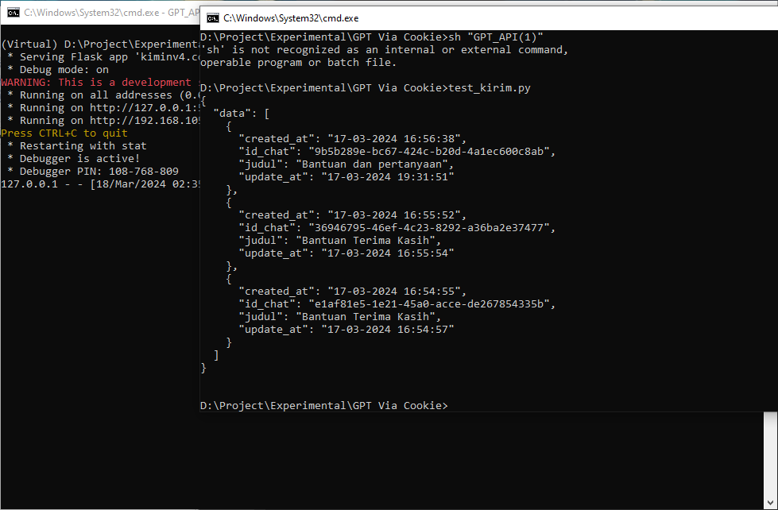
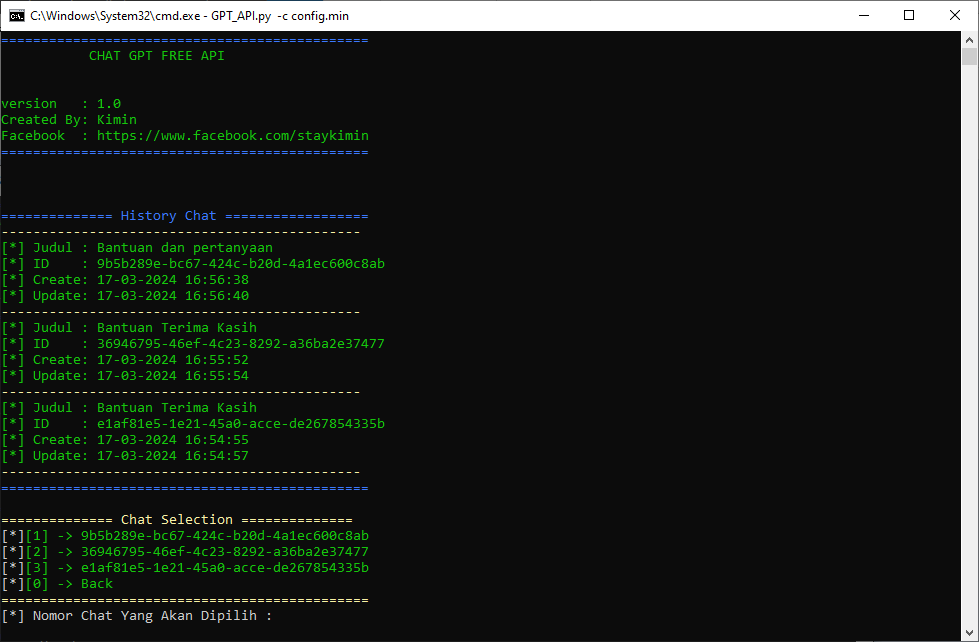
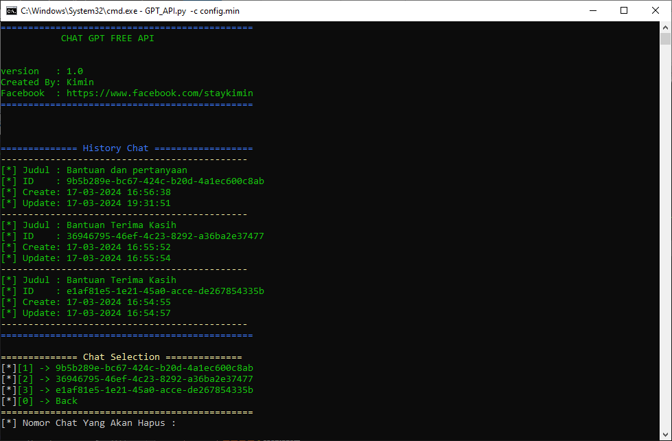
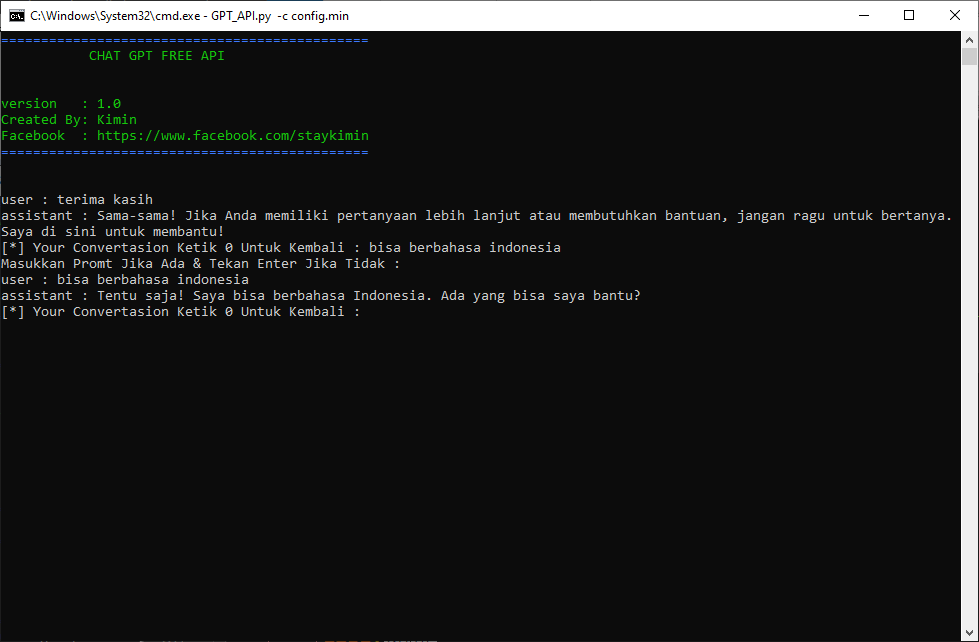
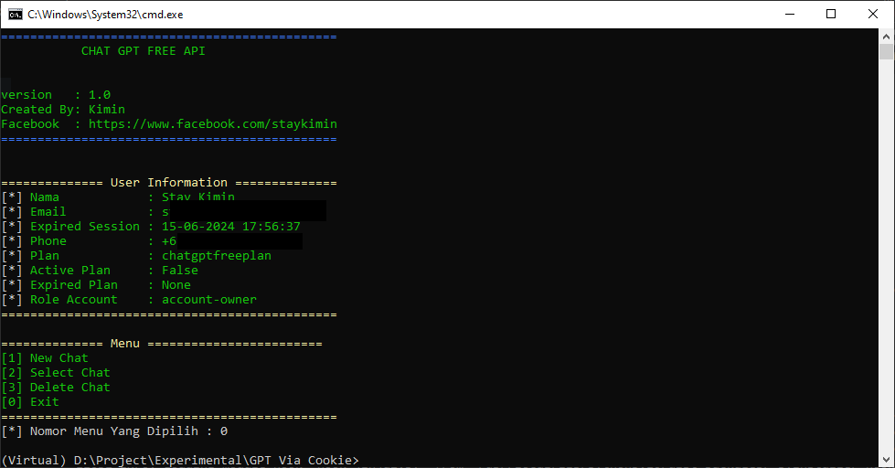

# GPT API

Program Untuk Membuat Endpoint/API Untuk Berinteraksi Dengan Chat GPT. Dibuat Menggunakan Flask dan Juga Requests Saja

## Fitur

- Melihat Detail User / Pengguna
- Melihat History Chat / Convertasion Dari User
- Melakukan Convertasion / Chat Dengan GPT Secara Langsung
- Menghapus Convertasion / Chat Dari Chat GPT
- Client Mode & Server Mode

## Cara Penggunaan

**Windows**

Pastikan Menjalankan Programnya via CMD / Terminal

*Client Mode*
```python
  GPT_API.exe -c config.min 
```

*Server Mode*
```python
  GPT_API.exe -c config.min -m server
```


**Linux**

*Tambahkan Hak Akses Untuk Menjalankan File*
```bash
   chmod +x GPT_API
```

*Client Mode*
```bash
   ./GPT_API -c config.min 
```

*Server Mode*
```bash
   ./GPT_API -c config.min -m server
```
#### Note : 
- config.min adalah nama file dimana cookie dan user-agent disimpan
- Hanya Gunakan User Agent Versi Mozila Firefox

## Config.min
Berikut Adalah Cara Conifugari Cookie dan User-Agent Pada File **config.min**

| Parameter | Type     | Description                       |
| :-------- | :------- | :-------------------------------- |
| `ua`      | `string` | **Required**. User Agent Ketika Saat Mengambil Cooie dan Harus Sama |
| `cookie`      | `string` | **Required**. Code Cookie Dalam Bentuk String |

Contoh
```bash
    {
        "ua": "Mozilla/5.0 (Windows NT 10.0; Win64; x64; rv:123.0) Gecko/20100101 Firefox/123.0",
        "cookie":"code_cookie"
    }
```

#### Note : 
- Pastikan Tidak Ada Error Json Pada file. Bisa Dicek Menggunakan https://jsonlint.com/
- Nama File Tidak Harus **config.min**
- Jika Sudah Login. Jangan Di Logout, Karena Cookie Juga Akan Ter Reset Kalau Melakukan Logout


## Server Endpoint

Berikut Adalah Endpoint Beserta Parameter Yang Bisa Digunakan Ketika Menggunakan Mode **Server**
#### Melihat Informasi User

```http
  POST /API/user_info
```

Contoh Pada Menggunakan Python
```python
    import requests
    url = "http://127.0.0.1:5000/API/user_info" 
    respon = requests.post(url, data={})
    print(respon.text)
```
#### Melihat History Convertasion /  Chat

```http
  POST /API/get_chat
```

| Parameter | Type     | Description                       |
| :-------- | :------- | :-------------------------------- |
| `id`      | `string` | **Required**. Id of item to fetch |

Contoh Pada Menggunakan Python
```python
    import requests
    url = "http://127.0.0.1:5000/API/get_chat" 
    respon = requests.post(url, data={})
    print(respon.text)
```

#### Menghapus Convertasion /  Chat

```http
  POST /API/delete_chat
```

| Parameter | Type     | Description                       |
| :-------- | :------- | :-------------------------------- |
| `id_chat`      | `string` | **Required**. ID Chat Yang Diambil Dari Chat GPT. **Example 538563a1-7200-4c56-b53f-e0906be91b59**|

Contoh Pada Menggunakan Python
```python
    import requests
    url = "http://127.0.0.1:5000/API/delete_chat"
    data= {"id_chat":"538563a1-7200-4c56-b53f-e0906be91b59"}
    respon = requests.post(url, data=data)
    print(respon.text)
```

#### Melakukan Convertasion / Chat

```http
  POST /API/new_chat
```

| Parameter | Type     | Description                       |
| :-------- | :------- | :-------------------------------- |
| `text`      | `string` | **Required**. Pertanyaan Yang Diajukan|
| `promt`      | `string` | Promt Jika Ada|
| `id_chat`      | `string` | Jika Ingin Melanjutkan Convertasion / Chat Pada ID Yang Sama|

Contoh Pada Menggunakan Python Untuk Membuat Convertasion / Chat Baru
```python
    import requests
    url = "http://127.0.0.1:5000/API/new_chat"
    data= {"text":"halo bisa bantu dalam bahasa iNDOnesia"}
    respon = requests.post(url, data=data)
    print(respon.text)
```

Contoh Pada Menggunakan Python Untuk Membuat Convertasion / Chat Pada Chat Yang Sudah Ada
```python
    import requests
    url = "http://127.0.0.1:5000/API/new_chat"
    data= {"text":"halo bisa bantu dalam bahasa iNDOnesia", "id_chat":"538563a1-7200-4c56-b53f-e0906be91b59"}
    respon = requests.post(url, data=data)
    print(respon.text)
```

#### Note : 
- URL / Lokasi Endpoint */API* Adalah URL Default dan Bisa Disesuikan Lagi Pada file **server_config.min**
- Nama file **server_config.min** Tidak Boleh Diubah

## Preview

<p style="display: flex; justify-content: space-between;">
    
    
    
    
    
    
    
</p>

## Authors

- [@staykimin](https://github.com/staykimin)

## Support

Support Saya Di :

- [Saweria](https://saweria.co/staykimin)
- [Facebook](https://web.facebook.com/profile.php?id=61557427611851)
